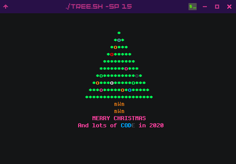
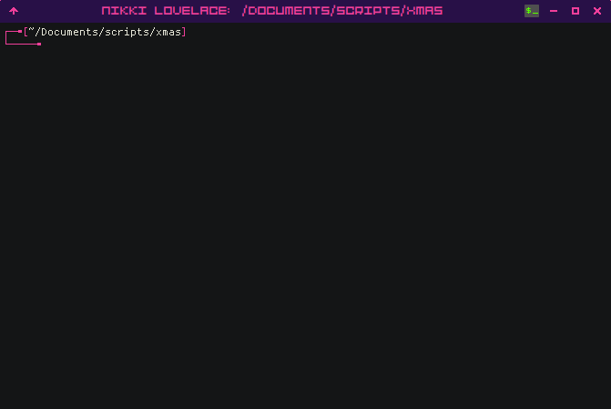

# ChristBASHTreeImproved

A fork of https://github.com/sergiolepore/ChristBASHTree with a few tweaks, like the adding options for customizing the tree and lights.

One major difference is that in this version the tree decorations are generated a single time. 

As usual, this is a WIP and PRs are welcome :)



# Usage

Via cURL:

```
# English version
curl https://raw.githubusercontent.com/strnikki/ChristBASHTreeImproved/master/tree.sh | bash

# Spanish version
curl https://raw.githubusercontent.com/strnikki/ChristBASHTreeImproved/master/tree.sh | bash
```

Via Wget:

```
# English version
wget -qO- https://raw.githubusercontent.com/strnikki/ChristBASHTreeImproved/master/tree.sh | bash

# Spanish version
wget -qO- https://raw.githubusercontent.com/strnikki/ChristBASHTreeImproved/master/tree.sh | bash
```

Git clone and execute:

```
git clone https://github.com/strnikki/ChristBASHTreeImproved.git && cd ./ChristBASHTreeImproved && bash tree.sh
```

You can also pass the following arguments when running script:

```
  -s|--size: height of the tree. Default: 10
  -tw|--trunk_width: width of the center of the trunk. Default: 1
  -nl|--number_lights: number of lights generated in the tree. Default: size*2
  -sy|--synchrony: synchrony of the lights in percentage. Default: 30
  -sp|--speed: the speed which the lights blink (a smaller number is faster). Default: 10
  -h|--help: shows this text
```



__Enjoy!__

## License
[Do what you want with it](./LICENSE) license.
